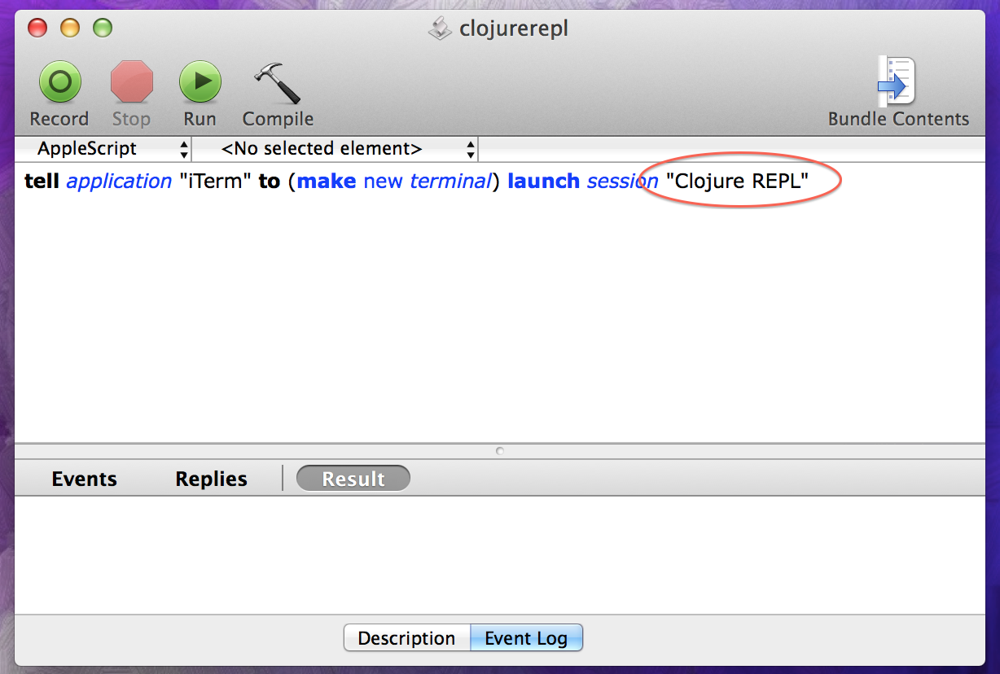

## Why did I do this?

After I posted a screenshot of all of my REPLs open at once a few Twitter people asked me to put something together on how I set them all up.

I like to be able to jump into a REPL to play, especially if I've read an interesting post, paper, or something from a book. I like colors and I like to be able to differentiate terminal sessions easily. I also prefer to run my apps fullscreen so my screen isn't so cluttered and I can more easily focus. I really like to be able to swipe between apps and use Alfred to launch apps that aren't currently running. It would have been really nice to type something in Alfred and bring up any one of my REPLs with a customized look and feel.

I had created a bunch of profiles already for all of my REPLs but it got really annoying to have to switch to iTerm2, and use the trackpad to select one of my profiles. Even more annoying is that they would open as a tab in the currently active iTerm window; I like them to be separate. After some googling it turns out, AFAIK, there is no way to pass the profile name as a command line parameter to the iTerm executable, so I couldn't create a bunch of shell scripts and invoke them. What to do...

## Find an image

OK... step one for any one particular language, assuming it's installed already, is to find its logo or whatever picture you want. We'll use the one for Clojure for this example. Ideally, it should be in PNG format and have a transparent background; I fid that looks and works the best. 

## Make a new image, staggering the original

I could have just tiled the whole background with this one but it didn't look very interesting. So I decided to stagger the original image and make it 200px X 200px. Again, that just seemed to be aesthetically pleasing.

## Create an iTerm2 profile

Next create a new iTerm2 profile; there are two things that are important here in the General tab. The first is naming the profile; you'll need to remember this for below. Secondly, you need to specify the shell command to actually start the REPL; type that into the "Send text at start" field as shown below:

Next, go to the Window tab and select and image and click the checkbox to tile it; you should see something like below:

You can also change the colors of the text and background but that should be self-explanatory. Now you should be able to see you lovely new REPL session:

## Create an AppleScript app

We're not quite done yet as we want to be able to launch this from with Alfred so save unecessary gestures and mouse clicks. And we also want to be able to specify the profile to use at runtime. Unfortunately, as of this writing, iTerm2 does not have a provision for specifying a profile via a command line switch.

So we need to resort to AppleScript in order to do this. I modelled my solution based on the SO answer given [here](http://superuser.com/questions/455915/mac-os-how-can-i-launch-the-iterm-terminal-with-a-specific-profile-from-autom/455936#455936).

This code below works for me; note the name of the profile here needs to be the one you typed above.

You can test it right here in the AppleScript editor to make sure that it works. Next, save it somewhere where it can be found by Alfred; I put all my little apps in ~/scripts. (That seems to be automagically searched by Alfred; I didn't have to add it manually so I can't quite explain that. :S) Make sure to save it as an Application.

Once you've done that you should be able to invoke it via option-space

Yay!
